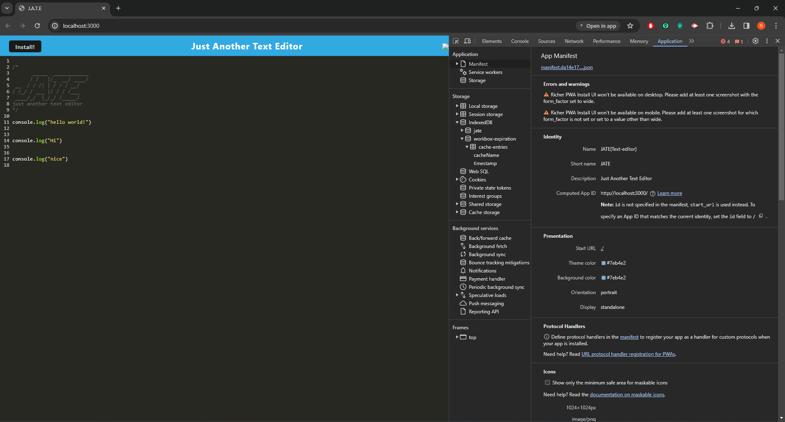
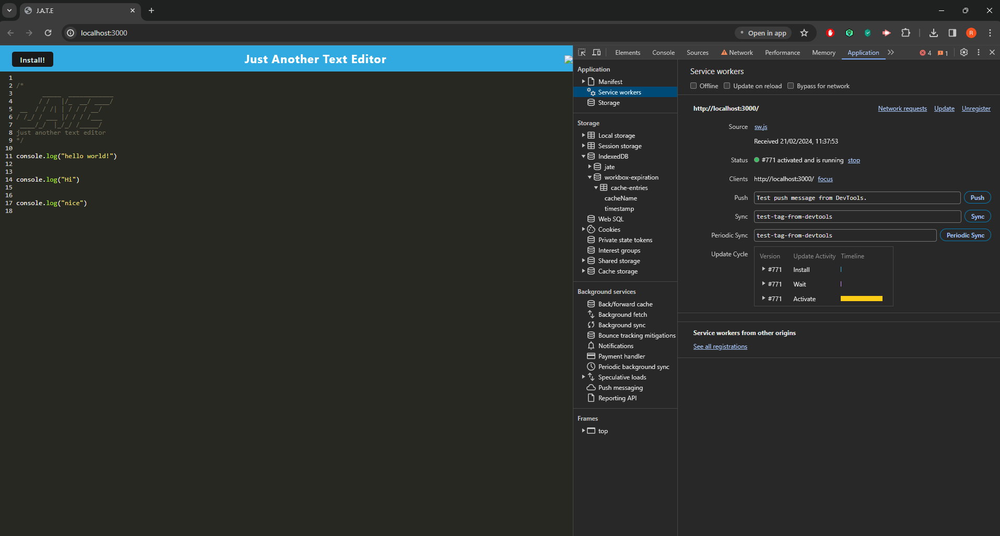
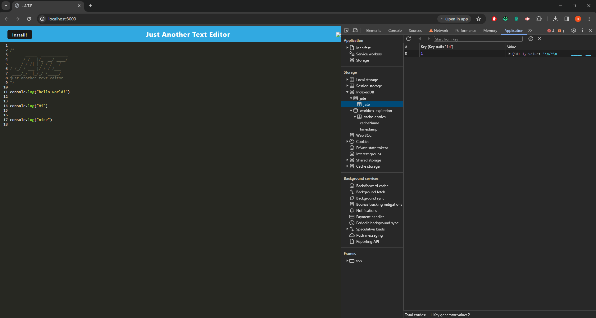

# Texterra-PWA

Progressive Web Application (PWA) that offers a simple yet powerful text editing experience directly in your web browser. Leveraging modern web technologies, Texterra allows for offline editing, complete with service worker-based caching and an elegant, user-friendly interface.









## Table of Contents

- [Deployment](#deployment)
- [Installation](#installation)
- [Usage](#usage)
- [Features](#features)
- [Technology](#technology)
- [Contributing](#contributing)
- [Credits](#credits)

## Deployment

[Link to web app](https://another-text-6df59f26a1f0.herokuapp.com/)

## Installation

To get started with Texterra-PWA, follow these steps:

1. Ensure you have [Node.js](https://nodejs.org/en/) installed on your machine.
2. Clone the repository to your local machine:

```bash
git clone git@github.com:rlobz/FriendSphere-API.git
```

3. Navigate to the project directory:

```bash
cd Texterra-PWA
```

4. Install the required npm packages from the root directory by running the following command in the terminal:

```bash
npm i && npm run build
```

5. Start the app by running the following command in your terminal, this command will start both the server and the webpack development server concurrently, allowing you to see the application in your browser: 

> npm run start:dev

6. Once the development server is running, you should be able to access the application by opening your web browser and navigating to the specified URL: http://localhost:3000 .

## Usage

After launching, you are presented with a straightforward text editing environment. Use the toolbar for text formatting options such as bold, italic, and underline.

## Features

- **Rich Text Editing**: Provides essential text editing features in a clean and intuitive interface.
- **PWA Support**: Installable as a PWA for seamless use on desktop and mobile devices.
- **Offline Functionality**: Edit and save your work even without an internet connection, thanks to service worker caching.
- **Auto-save**: Automatically saves your work to IndexedDB to prevent data loss.

## Technology

- JavaScript
- Node.js
- Express.js
- NPM 
- Nodemon
- Webpack
- Service worker 
- Babel
- Manifest.json
- IndexedDB
- Render

## Contributing

Contributions to this project are welcome. Please ensure that your code adheres to the existing style and conventions.

## Credits

**Rafal Lobzowski**
- Github: [@rlobz](https://github.com/rlobz)